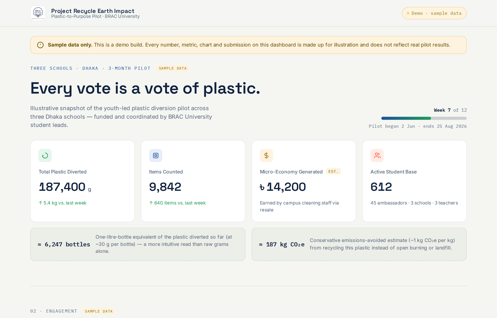

# Project Recycle Earth — Impact Dashboard

A single-page impact dashboard for **Project Recycle Earth's Plastic-to-Purpose pilot**, a youth-led plastic diversion programme run across three schools in Dhaka and coordinated by BRAC University students. Co-developed by Sandip Kumar Paul and Tanjila Afsari Rubina.

**[Live demo →](https://sandipkumarpaul.github.io/Project-Recycle-Earth_Dashboard/)**

> [!IMPORTANT]
> **This is a sample / demo build.** All numbers, metrics, charts, rankings and submissions shown on the dashboard (and in the screenshot below) are made-up sample data for illustration. They are **not** real results from the pilot.



<sub>Screenshot shows illustrative sample data, not real figures.</sub>

## About the pilot

Students "vote with plastic": each week, bins are split into two sections for a fun prompt (*Messi vs. Ronaldo?*), and the plastic sorted into each side counts as a vote. Every bin carries its own QR code. Ambassadors weigh and log the plastic through a Google Form, and a teacher verifies each entry. The collected plastic then goes to campus cleaning staff, who sell it in the local market and keep the proceeds.

The dashboard is designed to make that loop visible to students, teachers and sponsors. This repository contains a demo version filled with sample data.

## Features

- **Impact KPIs**: total plastic diverted, items counted, resale income and active students, with animated counters and week-over-week change
- **Real-world equivalents**: plastic diverted shown as 1-litre bottles and as avoided CO₂e
- **Gamification**: a split bar for this week's prompt, plus a school-vs-school leaderboard. Clicking a school expands its weekly trend.
- **Circular economy map**: an SVG ring and stage list tracking plastic from collected → weighed → handed off → sold
- **Cumulative trend chart**: a responsive SVG line chart with week-by-week tooltips
- **Submissions feed**: this week's entries from each school, with teacher-verification status
- **Countdown**: counts down to the closing ceremony and switches to a "held" state once the date has passed

## Tech

- Plain **HTML, CSS and vanilla JavaScript** in one file. No framework, no build step, no dependencies.
- The charts are hand-built SVGs, so no chart library is needed.
- **Data-driven**: one `DATA` object at the top of the `<script>` holds every number on the page. The totals, rankings, percentages, chart points and equivalents are all calculated from it, so the figures always agree with each other. In a real deployment, that object would be filled from the Google Sheet behind the submission form.
- Responsive down to phone width. The leaderboard works with the keyboard and uses `aria-expanded` on each row, and the page respects `prefers-reduced-motion`.

## Run locally

```bash
git clone https://github.com/sandipkumarpaul/Project-Recycle-Earth_Dashboard.git
cd Project-Recycle-Earth_Dashboard
python3 -m http.server 8000   # or just open index.html in a browser
```

Then visit <http://localhost:8000>.

## Updating the data

Edit the `DATA` object in `index.html`. It currently holds sample values only; replace them with real figures before using the dashboard for reporting. To add a week, append one value to each school's `weeklyKg` array. The week counter, KPIs, leaderboard, chart and feed all update from that. The two conversion factors, `BOTTLE_GRAMS` and `CO2E_PER_KG`, sit just below the object.

## Project structure

```
├── index.html          # the dashboard (markup, styles, data, and rendering logic)
├── assets/
│   └── bracu-logo.png
└── docs/
    └── screenshot.png
```

> **Disclaimer:** every figure on the dashboard is made-up sample data from a demo build. None of it reflects real measurements. The CO₂e and bottle equivalents also use rough, illustrative factors.
